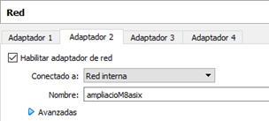

# Activitats d'ampliació DHCP (M0375 ASIX2)

## AMPLIACIÓ 7 -- MÚLTIPLES DHCP i CONTROL D'ACCÉS

**NOM DE L'ALUMNE/s:**

## OBJECTIU

- **Treballar en situacions on hi ha múltiples DHCP, ja sigui des del propi servidor donant múltiples configuracions, com des de servidors diferents dins la mateixa LAN. A més també revisarem situacions on cal filtrar i/o l'accés dels usuaris al servei.**

## INSTRUCCIONS

- **L'activitat és d'ampliació i per tant, voluntària.**

- **És de realització individual.**

- **Per defecte, cal que justifiqueu les respostes amb captures de pantalla.**

- **Si a la captura no hi ha cap valor que la identifiqui de forma única, cal que es vegi el fons d'escriptori, notepad o eines similars amb el vostre nomcognom!**

## VERSIÓ

- **Creació [David Bancells](mailto:dbancells@sapalomera.cat)**

- **Actualització 01/09/25 Francesc Barragán**
---

Fins ara hem treballat en una situació bàsica, on hi ha un únic servei de DHCP a un únic servidor dins la mateixa LAN. Això és habitual en xarxes petites, però cal tenir en consideració l'augment de complexitat i situacions que podem tenir en una xarxa mitjana o gran.

Una de les configuracions més habituals és tenir un servidor que doni DHCP a diferents LANs a les quals està connectada directament. Per simular-ho de forma senzilla, tant al servidor Windows com a l'Ubuntu activarem un segon adaptador, en mode 'xarxa interna', tal com veieu a la imatge d'exemple.



D'aquesta manera, simularem que els servidors tenen accés a dues LAN, la 172.25.X.0/16 que ja heu vist prèviament, i una segona, que serà 192.168.X.0/24.

Per començar doncs, caldrà que al Windows Server hi assigneu una IP fixa al segon adaptador, amb el rang anteriorment dit.

### a) Adjunteu una captura dels valors de 'ipconfig' al Windows Server per veure les dues interfícies de xarxa configurades. *0,75 punts*.

Tot seguit, caldrà configurar el segon àmbit dins el servei de DHCP, mantenint la configuració del cas pràctic 2. En aquest cas, cal que ho feu a través de l'entorn GUI. A nivell d'opcions, deixeu les que venen per defecte, excepte el rang a configurar, que podeu utilitzar el mateix interval que a l'àmbit ja creat prèviament.

### b) Un cop ho hàgiu fet, adjunteu una captura de la opció 'Contenido del servidor DHCP' on us han d'aparèixer els dos àmbits configurats i en estat actiu. *1 punt.*

Ara, abans d'arrancar els clients, feu que la Ubuntu segueixi anant a la xarxa original, per tant, amb el primer adaptador, i el Windows client es connecti al nou rang 192.168.X.0/24 de forma que activeu-li el segon adaptador.

### c) Un cop els clients tinguin la corresponent IP, cal que ho demostreu des del Windows Server amb la instrucció de Powershell que ens mostra els diferents 'leases' assignats en aquell moment. Ho haureu de fer pels dos àmbits. *1 punt*.

Ara toca apagar el Windows Server i fer el mateix amb la Ubuntu Server.

### d) Així doncs, cal que configureu una IP estàtica al segon adaptador de la Ubuntu Server i ho demostreu executant la comanda `sudo ip -a -br address` un cop realitzat. *0,75 punts*.

Ara que ja tenim la configuració de xarxa feta, i mantenint les configuracions del cas pràctic 3, cal que afegiu el que sigui necessari a la configuració per tal que doni servei també per aquest nou rang. L'interval el podeu fer igual que el del cas pràctic 3.

### e) Demostreu amb una captura de l'execució per obtenir la configuració `sudo egrep -v ^# /etc/dhcp/dhcpd.conf | grep .`. *1 punt*.

### f) Amb els clients ja associats a les IPs corresponents a partir de la Ubuntu Server, adjunteu una captura de l'execució de `dhcp-lease-list` per veure que realment s'han assignat com pertoca. *0,75 punts*.

Si heu mantingut la configuració tal com es va deixar al cas pràctic 3, feu un ipconfig al Windows client i analitzeu si la configuració de xarxa que hi ha és correcta, què hi ha de malament, perquè està malament i com seria una bona opció corregir-ho.

### g) Adjunteu les captures i explicacions corresponents. *1 punt*.

---

Fins aquí podríem dir que seria una configuració força habitual i comuna. Què passa però si afegim complexitat i treballem amb dos servidors DHCP dins el mateix segment de LAN? Quines situacions i implicacions hi ha?

- Com saben els meus clients quin utilitzar o a quin estan 'assignats'?
- Com puc configurar els servidors d DHCP per proporcionar adreces per al mateix segment de xarxa?

Cal que no oblidem que DHCP funciona via broadcast, i que, per defecte, funciona amb 'first-come-first-serve', de forma que el primer que contesta és qui li serveix la configuració.

Si volem tenir dos servidors a la mateixa xarxa LAN, podríem agafar el model del cas pràctic 3, on donàvem servei a través de dos subrangs diferents dins el mateix àmbit de DHCP, i que un servidor s'encarregués d'un rang, i l'altre, de l'altre. Així, pel rang assignat al client, sabríem fàcilment quin servidor DHCP li ha donat el servei.

Fem la prova amb el Windows server i la Ubuntu Server. Torneu a deixar les màquines virtuals (clients i servidors) amb un sol adaptador, el primer, amb la xarxa NAT que teniu assignada.

Arranqueu primer el Windows Server, elimineu la reserva d'IP si encara la teniu, i deixeu el rang que ja teniu configurat, que hauria de ser de la 172.25.X.100 a la 150. Després, configureu la Ubuntu Server per tal que només serveixi el rang 172.25.X.210 a 215.

Ara, arranqueu els 2 servidors, i després del client Windows. Arribats a aquest punt, jo no us puc dir quin dels dos funcionarà ja que no es pot saber, però si que podem 'jugar' una mica, mirar què passa i alterar una mica el comportament.

Des de la Ubuntu Server, llanceu `sudo tcpdump -i any -n port 67 or port 68` i aneu fent, des del Windows client, peticions amb `ipconfig /release` per alliberar i `ipconfig /renew` per demanar IP.

### h) Després de fer-ne 3 o 4, adjunteu una captura amb els valors del tcpdump. *1 punt*.

Per "forçar-ho" una mica, podem fer ús d'una configuració del Windows Server, que és un valor de 'delay' o retard. Pel que fa al retard de la subxarxa, aquesta és la quantitat de temps en mil·lisegons que el servidor DHCP espera abans d'enviar un DHCPOFFER. El valor per defecte és 0; quan teniu dos servidors DHCP que donen servei a la mateixa subxarxa IP, podeu canviar la configuració predeterminada del vostre servidor DHCP de prioritat inferior augmentant el valor del retard de la subxarxa.

### i) Així doncs, dins les propietats de l'àmbit, cal que aneu a les opcions avançades i poseu el valor màxim a 'retraso de subred', que serà de 1000ms. Adjunteu la captura corresponent. *0,75 punts*.

Això en principi provocarà que si torneu a llançar peticions i ho mireu amb el tcpdump, el Windows no respongui mai ja que primer hauria de respondre la Ubuntu Server.

Tot això és molt interessant si controlem els servidors, però també podem mirar què està passant a una xarxa, sobretot si hi ha un mal funcionament i l'hem de diagnosticar.

Agafeu la Ubuntu Client i llanceu `sudo apt-get update && sudo apt-get install dhcpdump`. Aquesta eina ens permetrà analitzar el comportament DHCP dins la xarxa. En aquest cas, si la proveu, ens mostrarà el que heu vist a h) però amb molt més detall.

No obstant, aquests no serien els muntatges més habituals ni convenients. Quan es vol treballar amb múltiples servidors de DHCP sovint s'utilitza el protocol DHCP failover.

---

Per altra banda, també hem de tenir en compte que en un sistema de comunicació per broadcast podem rebre peticions de qualsevol equip, i sovint, cal limitar-les, classificar-les o directament bloquejar-les.

Imagineu que hem detectat un atac de DDoS per tal de saturar-nos a peticions de DHCP, pel que agafarem aquella o aquelles MAC i les posarem a un filtre per tal de no assignar-los IP.

Per simular-ho amb el Windows Server, dins la configuració del DHCP, cal que dins de 'Filtros', a la opció de Denegar, hi poseu la MAC de la Ubuntu Client o del Windows Client. Compte perquè per defecte aquestes opcions estan desactivades.

### j) Adjunteu una captura de la configuració dels filtres per demostrar que heu activat un bloqueig. *1 punt*.

Evidentment si ho comproveu, veureu que ara no agafa IP; tot i que si llança la petició, el servidor no la contesta.

Avançant una mica més, també podríem crear directives, que, a partir de certes condicions, podrien donar una configuració o una altra als diferents clients.

De la mateixa manera, i des de Linux, cal tenir en compte que ISC és extremadament potent i pot fer el mateix però a més de forma més avançada, igual que moltes altres opcions que no estan dins l'abast d'aquesta activitat.

---

En aquest darrer cas, mantenint la configuració anterior a la Ubuntu Server on donàvem IPs de dos subrangs separats dins el vostre 172.25.X.0/16, farem que quan hi hagi una petició des d'un Ubuntu client, li doni un subrang, i si és Windows Client, li doni un altre subrang.

Per això haureu de fer ús dels paràmetres de configuració "class" i "pool" dins del dhcpd.conf.

Primer, caldrà definir una classe que "agruparà" els clients Ubuntu, i una, que "agruparà" els clients Windows. Per fer el filtratge hi ha moltes maneres, però aquest cop, aprofitant les instruccions de treball del MP, ho farem simple i ho filtrarem pel hostname.

Així doncs, cal que afegiu el següent al vostre arxiu de configuració dhcpd.conf.

```
class "UBUNTU" {
    match if (substring(option host-name,0,5) = "ucli-");
}

class "WINDOWS" {
    match if (substring(option host-name,0,5) = "WCLI-");
}
```

Tot seguit, caldrà que feu modificacions al vostre 'subnet', utilitzant la sentencia 'pool' per tal de fer que els del grup UBUNTU vagin a un subrang dins la vostra subxarxa, i els clients WINDOWS, a un altre.

### k) Un cop fet, per finalitzar, caldrà que adjunteu dues captures. Per una banda, la de la configuració, amb `sudo egrep -v ^# /etc/dhcp/dhcpd.conf | grep .` i l'altra, la dels clients associats, amb 'dhcp-lease-list'. *1 punt*.
