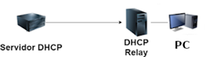
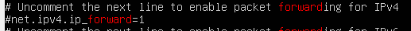
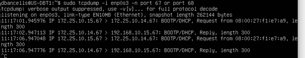
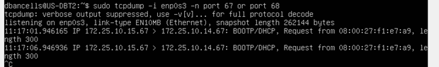

# NF1 -- EL SERVEI DE DHCP

## AMPLIACIÓ 2 -- DHCP FAILOVER i DHCP RELAY

**NOM DE L'ALUMNE/s:**

## OBJECTIU

- **Treballar en situacions de DHCP avançades, tals com un DHCP que arribi més enllà del seu segment de xarxa, i un doble DHCP en situació de mestre/esclau per tal d'aportar major disponibilitat i resoldre situacions on un dels servidors caigui.**

## INSTRUCCIONS

- **L'activitat és d'ampliació i per tant, voluntària.**

- **És de realització individual i té un pes de 6,5% respecte el 10% d'ampliació del NF.**

- **Per defecte, cal que justifiqueu les respostes amb captures de pantalla.**

- **Si a la captura no hi ha cap valor que la identifiqui de forma única, cal que es vegi el fons d'escriptori, *notepad* o eines similars amb el vostre nomcognom!**

## VERSIÓ

- **Creació [David Bancells](mailto:dbancells@sapalomera.cat)**

- **Actualització 01/09/25 Francesc Barragán**

---

En aquesta darrera activitat d'ampliació del NF1 treballarem amb dos sistemes avançats de gestió del DHCP: el DHCP *Relay* i el DHCP *Failover*.

Per poder realitzar l'activitat, treballarem amb la Ubuntu Server, que caldrà clonar-la per tal de tenir 2 servidors. Recordeu que, un cop clonat, editeu-ne el hostname segons les especificacions indicades al document d'instruccions penjat al moodle.

A nivell de xarxa, necessitarem treballar en dos modes de configuració separats, de forma que s'especificarà a cada apartat en concret.

## DHCP relay

Comencem doncs pel DHCP Relay. Tal com teniu descrit a la teoria avançada, el DHCP Relay ens permet arribar a segments de xarxa diferents d'on resideix el propi servei de DHCP. D'aquesta manera eliminem la necessitat de que un servidor DHCP hagi de connectar-se directament a cada segment de xarxa on ha de donar servei. Hi ha moltes maneres de fer-ho funcionar segons l'estructura de la xarxa, aquesta és una demostració senzilla del procés més habitual.

A nivell de l'activitat, ens caldrà tenir una Ubuntu Server amb un adaptador de xarxa en mode 'xarxa NAT' assignat al rang preestablert al MP, i la segona Ubuntu Server amb dos adaptadors, el primer dels quals ha d'estar amb la mateixa configuració de xarxa que l'anterior a nivell de Virtualbox, i el segon adaptador de xarxa ha d'estar en mode 'xarxa privada' sota el rang 192.168.X.0/24. Recordeu però que al clonar-la, la IP a nivell de sistema serà la mateixa que al servidor primari, de forma que entreu i via netplan canvieu-la (si per exemple acaba en 15 feu que el segon servidor acabi en 16).

L'esquema amb el que pretenem treballar és el següent:



Com a PC podeu utilitzar qualsevol dels dos clients que teniu, o tots dos, amb una configuració de xarxa d'un adaptador en mode 'xarxa privada' amb el rang 192.168.X.0/24 i configurats per obtenir la IP en mode DHCP.

Abans de començar a treballar i configurar el DHCP, caldrà que realitzeu dos passos previs a la Ubuntu Server que farà de DHCP Relay. Tal com veieu, aquesta Ubuntu veu dues xarxes, i cal activar el *forwarding* per tal que permeti travessar el trànsit d'una interfície de xarxa a la altra.

Per això, cal que editeu el fitxer /etc/sysctl.conf i concretament la línia:



Tal com veieu, us diu que ho descomenteu per tal de que quedi aquest valor activat. Un cop fet el canvi, podeu reiniciar la màquina o llançar la comanda `sudo sysctl --system` per tal que es carreguin els nous canvis.

En aquesta mateixa Ubuntu caldrà activar el servei de DHCP Relay, i si l'heu clonat de la original, us facilitarà la feina el fet de desinstal·lar el servei de DHCP a nivell de server.

El paquet que cal instal·lar és: isc-dhcp-delay. Quan l'instal·leu us sortirà un assistent, aneu fent 'intro' amb les opcions per defecte o poseu-hi alguna cosa irrellevant perquè ho reconfigurarem després.

### a) 
Per demostrar aquesta primera part, cal que llanceu les següents dues comandes i n'adjunteu el resultat de les captures: `sudo dpkg -l | grep dhcp` i `sudo cat /proc/sys/net/ipv4/ip_forward`. *0,5 punts*.

Tot seguit, anem a preparar el servei de DHCP 'real'. Per anar més ràpid i facilitar-vos la feina, reanomeneu el fitxer de dhcpd.conf que ja teniu a dhcpd.conf.original (per exemple) i genereu un nou fitxer dhcpd.conf buit. Després hi inseriu el següent codi:

```
default-lease-time 600;
max-lease-time 7200;

subnet 172.25.0.0 netmask 255.255.0.0 {
    range 172.25.X.66 172.25.X.69;
    option routers 172.25.X.Y;
}

subnet 192.168.X.0 netmask 255.255.255.0 {
    range 192.168.X.50 192.168.X.55;
    option routers 192.168.X.Z;
}
```

On evidentment caldrà que substituïu els valors de forma convenient a partir dels vostres valors assignats. Tot i que no tenim una IP al servidor del rang 192.168.X.0/24, ho necessitem perquè quan arribin peticions de la xarxa privada 192.168.X.0/24 torni valors per aquest rang.

### b) 
Adjunteu una captura amb el valor del fitxer /etc/dhcp/dhcpd.conf un cop configurat. *1 punt*.

Ara tocarà configurar el servei de DHCP Relay. Per això llanceu `sudo dpkg-reconfigure isc-dhcp-relay` al servidor on teniu el paquet per fer de Relay. Primer us preguntarà la IP del servidor DHCP real, pel que haureu de posar la IP de la Ubuntu Server dins el rang 172.25.X.0/16 on heu configurat el servei. Després, quines interfícies participen en el procés de DHCP relay, i per últim les opcions. Podeu deixar-ho per defecte, sobretot la de les interfícies, perquè tal com ho descriu sembla que només indiqui quina interfície rebrà les peticions de DHCP, però si no hi consten les 2 (o més) que hi participen, les bloquejarà quan tornin. Per això ho deixem en blanc i així les tindrem totes habilitades.

### c) 
Un cop ho tingueu configurat, aquesta configuració s'haurà allotjat al fitxer /etc/default/isc-dhcp-relay, pel que adjunteu una captura amb el seu contingut. *0,5 punts*.

En principi tot està llest, de forma que arranqueu un client configurat amb un adaptador de xarxa en mode 'xarxa privada' assignada al rang 192.168.X.0/24.

A nivell de logs, hauríeu de veure al servidor de DHCP Relay com arriba una petició amb la MAC del client i es reenvia cap a la IP del servidor DHCP real, i al servidor DHCP real hauríeu de veure com arriba la petició de la MAC del client i se li ofereix una IP del rang on està, ja que ve identificada per la IP del rang 'xarxa privada' del segon servidor.

No obstant, no hauria d'haver anat bé. El client us hauria d'haver donat *timeout* al rebre la IP. Anem a veure perquè.

### d) 
Primer demostrem amb els logs el que dèiem, de forma que caldrà que adjunteu una captura de la MAC del client, una captura del /var/log/syslog del servidor de DHCP Relay, on hi constarà la MAC del client associada a un 'forward' cap a la IP del servidor DHCP real, i finalment, els logs del servidor DHCP real conforme si li arriba el DHCPDISCOVER i ell contesta amb un DHCPOFFER del rang que pertoca, ja que amb el DHCPDISCOVER la petició arriba amb la IP del rang 'privat'. *1 punt*.

Així doncs, com és que no ens funciona correctament? Us ajudaré una mica. Anem a veure amb el *tcpdump (sniffer*) què passa a nivell de xarxa.



En aquesta primera imatge, veieu com el meu servidor 1, el que fa de DHCP rep les peticions i les contesta, però fixeu-vos que les contesta a la IP 192.168.10.15, que és la IP del rang 'privat' del meu servidor 2.

Si apliquem el filtre al segon servidor, el de DHCP Relay, veiem el següent:



Només veiem passar les peticions de Request, però no els Reply. Això és perquè tenim un problema bàsic de xarxa. El servidor 1 envia pel seu default gateway les peticions a la xarxa 192.168.X.0/24 ja que no té cap ruta que li digui que està darrera el servidor 2.

Així doncs, cal que afegiu una ruta estàtica des del servidor 1 cap al servidor 2 per indicar-li quina xarxa hi ha al darrera.

### e) 
Adjunteu una captura amb la comanda que afegeix la ruta i una altra comanda que mostra les rutes que té el servidor 1. *0,75 punts*.

Sense fer res més, feu una nova petició d'IP des del client i us hauria de funcionar correctament.

### f) 
Adjunteu una captura que mostri la configuració de xarxa al client obtinguda per DHCP. *0,75 punts*.

### g) 
Torneu a obrir els logs del servidor 1 i 2 servidor dos i ara veureu com han canviat. Al servidor 2 hi apareixerà el forward anterior i a més hi constarà que s'ha reenviat el reply. Al servidor 1 hi constaran les 4 fases del protocol DHCP. Adjunteu les captures corresponents que així ho demostren. *1 punt*.

Si tot ha anat correctament podreu fer ping tranquil·lament des del client a la IP del server de DHCP real.

Per últim, feu un darrer canvi a la Ubuntu de DHCP Relay. Recordeu que aquest server té 2 IPs estàtiques, però volem que la de l'adaptador que connecta amb el servidor de DHCP real també s'obtingui per DHCP.

### h) 
Així doncs, canvieu el netplan perquè així sigui i llanceu una petició de renovació d'IP amb `sudo dhclient -v`. Adjunteu la captura corresponent. *1 punt*.

No obstant, ara apareix un altre problema. Recordeu que hem afegit aquella ruta estàtica al servidor 1? Ara doncs, la IP de destí de la ruta estàtica ha canviat i per tant, novament no arribaran les peticions de DHCP a la xarxa de DHCP Relay. Aquest punt es pot solucionar, com per exemple, fixant la IP del server2 via DHCP amb reserva, però està pensat perquè us n'adoneu de lo important que és tenir clara l'estructura de xarxa i els elements realment clau que han de tenir IP fixa, sigui de la manera que sigui.

---

## DHCP Failover

Per tal d'oferir redundància, sobretot en sistemes grans o d'alta disponibilitat en cas que falli un servidor, el protocol DHCP Failover subministra sincronització entre dos servidors DHCP, mantenint que ambdós servidors tinguin una base de dades IP consistent.

Novament, amb la Ubuntu Server i el seu clon, gràcies al servei DHCP de ISC, podem configurar-los per tal que utilitzin aquest protocol. Us aconsello esborrar la configuració del dhcpd.conf dels dos servidors i fer-la de nou seguint les instruccions d'aquest enunciat. A nivell de xarxa, ambdós treballaran amb un adaptador 'xarxa NAT' i un client amb un o més adaptadors també configurat amb 'xarxa NAT' assignat al vostre rang predeterminat.

La configuració del protocol DHCP Failover sota ISC es basa en la declaració 'failover peer' a cadascun dels servidors, on s'especifica la relació i la seva connexió amb l'altre servidor. Posteriorment, en la definició dels *pools* i rangs, caldrà indicar que s'han de vincular al servei de Failover.

Per fer-ho més senzill, podeu basar-vos en les configuracions descrites al final d'aquesta pàgina web: [https://www.fpgenred.es/DHCP/protocolo_dhcp_failover.html](https://www.fpgenred.es/DHCP/protocolo_dhcp_failover.html)

Així doncs, editant-les en cada cas, apliqueu aquestes configuracions al servidor Ubuntu Server 1 i 2.

### i) 
Quan ho tingueu, adjunteu una captura de `sudo cat /etc/dhcp/dhcpd.conf | grep .` d'ambdós servidors. *1 punt*.

Per demostrar que tot funciona correctament, caldrà provar-ho i revisar-ne els logs. Per tant, arranqueu el client i fixeu-vos en la MAC des d'on demanareu la IP via DHCP. Un cop tingui IP, si llanceu la comanda dhcp-lease-list als dos servidors veureu que tots dos tenen la informació.

### j) 
Ara, feu un `sudo cat /var/log/syslog | grep MAC` on cal substituir MAC per la MAC del vostre client i veureu les peticions. Cal adjuntar les captures dels logs dels dos servidors. *1 punt*.

### k) 
Quines diferències principals hi veieu entre les dues captures? Que poden indicar o què confirmen? *0,5 punts*.

Finalment, pareu un dels dos servidors, espereu-vos un minut, torneu a llançar una petició de DHCP i us hauria de funcionar correctament. Torneu a arrancar el servidor aturat, espereu-vos un minut i atureu l'altre. Espereu-vos un minut i llanceu una petició de DHCP, que també us hauria d'haver funcionat correctament. Finalment, arranqueu el servidor aturat i els tindreu tots dos novament donant servei.

### l) 
Adjunteu una captura d'executar `sudo cat /var/log/syslog | grep -i failover` d'un dels dos servidors. Veureu els missatges de sincronització entre els dos servidors i el seu estat. *1 punt*.